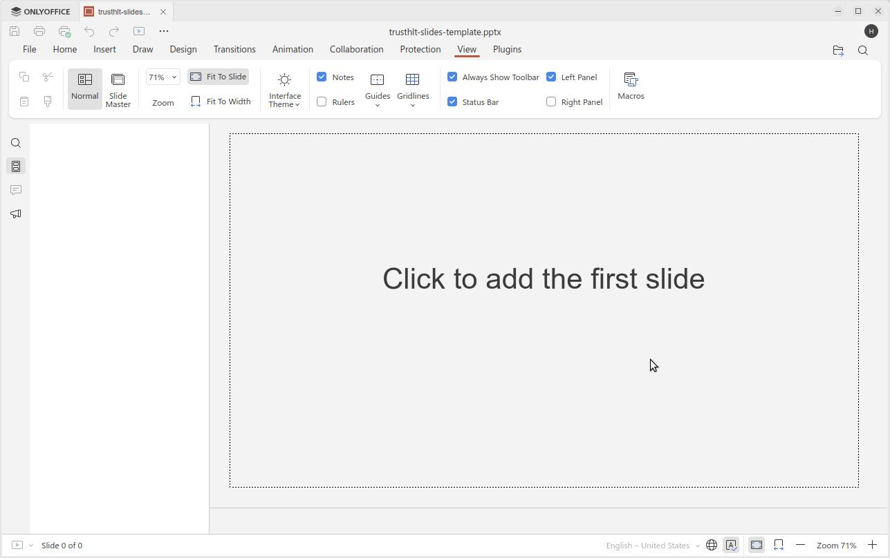
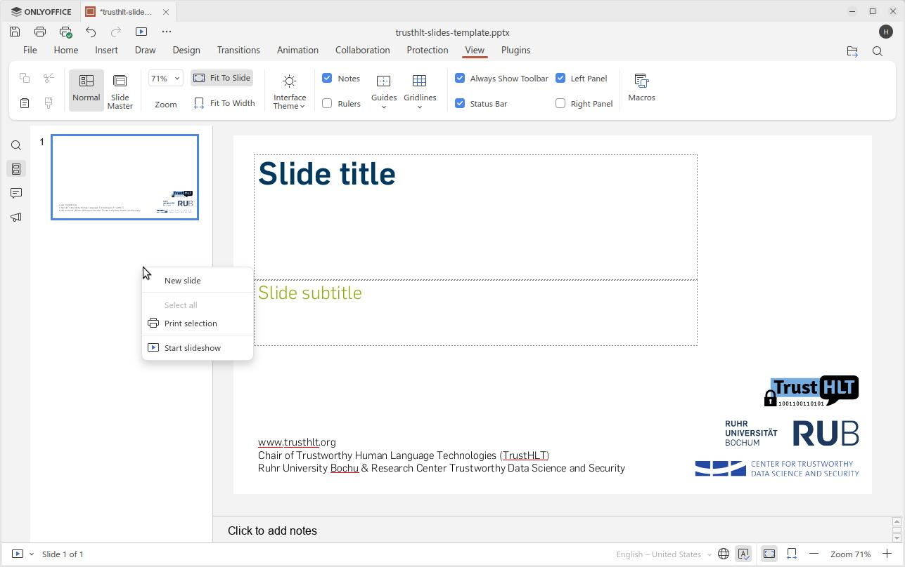
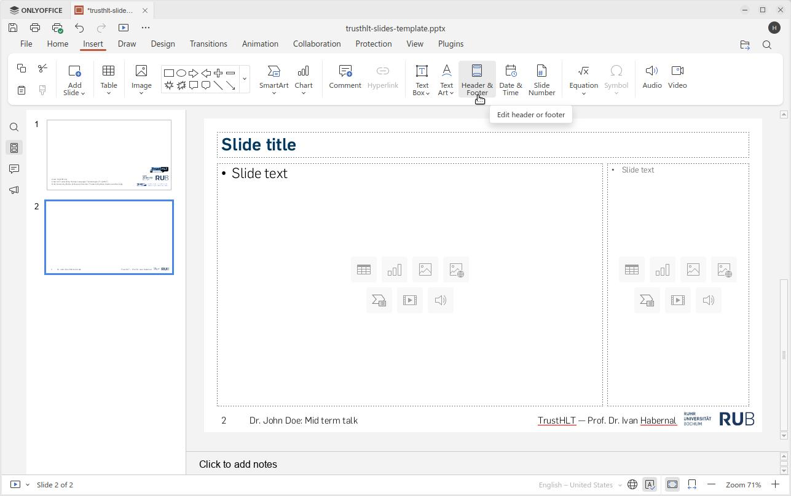
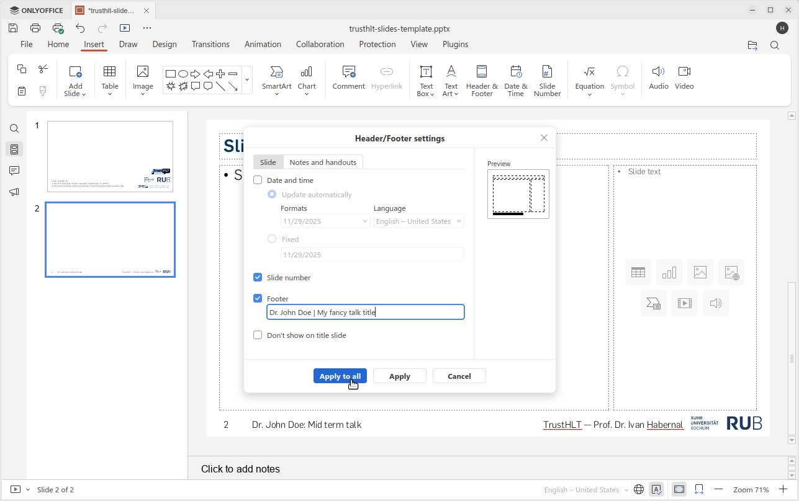
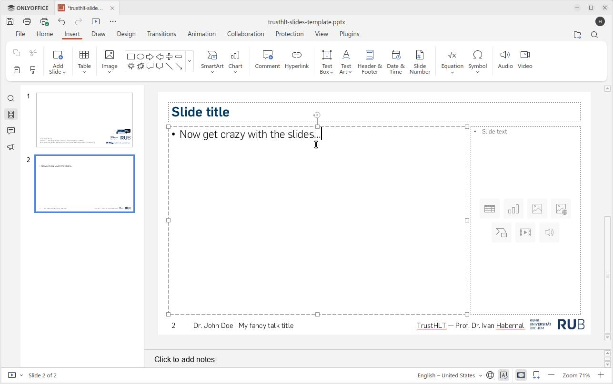

# slides-templates
TrustHLT templates for slides in LaTeX and other formats

## RUB fonts

All versions of thetemplate use the RUB fonts, so you need to install them first. For Latex, there's even a script

```bash
$ chmod +x install-rub-fonts.sh
$ ./install-rub-fonts.sh
```

## Slides template for PowerPoint/OnlyOffice

Tested with OnlyOffice desktop edition on Ubuntu ( https://www.onlyoffice.com/download-desktop )

Creating a new presentation is super easy, first open the template, click to add the title slide



Right click on the left to add the next regular slide ("New slide")



Under "Insert" -> "Header & Footer" change the footer to your name and talk title



And "Apply to all" so it gets properly rendered (on the regular slides)



and continue doing whatever you want.



There is an example file `trusthlt-slides-example1.pptx` and its PDF rendered version `trusthlt-slides-example1.pdf`.

## Slides template for LaTeX beamer

### Necessary LaTeX packages

If you run a linux distribution (e.g., Ubuntu 24.04 and newer), all packages are provided as part of `texlive`. Install the following packages

```plain
$ sudo apt-get install texlive-latex-recommended texlive-pictures texlive-latex-extra \
texlive-fonts-extra texlive-bibtex-extra texlive-humanities texlive-science \
texlive-luatex biber rubber wget -y
```

Compile the output PDF with `lualatex` and `biber` (using `rubber` for orchestrating re-compilation easily)

```plain
$ rubber --module lualatex 20XX-XX-XX-who-where.tex
```

#### Compiling slides using Docker

If you don't run a linux system or don't want to mess up your latex packages, I've tested compiling the slides in a Docker.

Install Docker ( https://docs.docker.com/engine/install/ ), e.g. `apt-get install docker.io` and add the user do the `docker` group on Linux

Create a folder to which you clone this repository (for example, `$ mkdir -p /tmp/slides`)

Run Docker with Ubuntu 24.04 interactively; mount your slides directory under `/mnt` in this Docker container

```plain
$ docker run -it --rm --mount type=bind,source=/tmp/slides,target=/mnt \
ubuntu:24.04 /bin/bash
```

Once the container is running, update, install packages and fonts as above, and compile the PDF output
